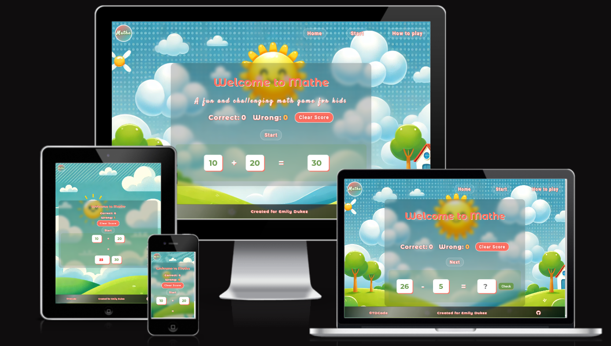

# emily-math

A simple HTML, CSS, and JavaScript math game written for my niece Emily to practice her things.

[Live link](https://emily-math.web.app/)

## Ver. 1

- Score (right/wrong answers) saved in local storage. Can be reset.
- Quiz game - user is given task with:
  - random num1 (10-100)
  - random num 2 (1-10)
  - random operation (-, +)
- gives a correct answer if answered incorrectly

## Ver. 2 (in progress)

- add selector for the tasks - more tasks according to the student's progression in classes

